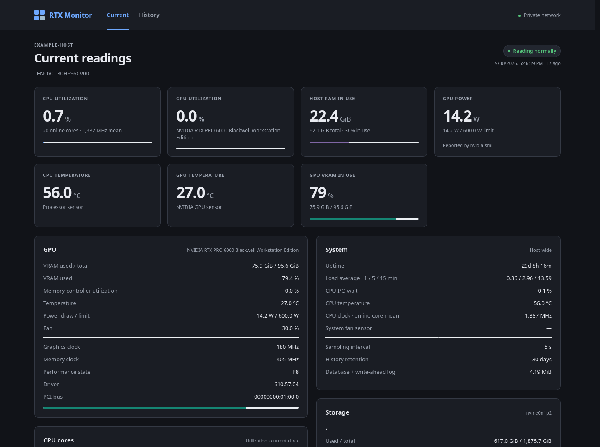
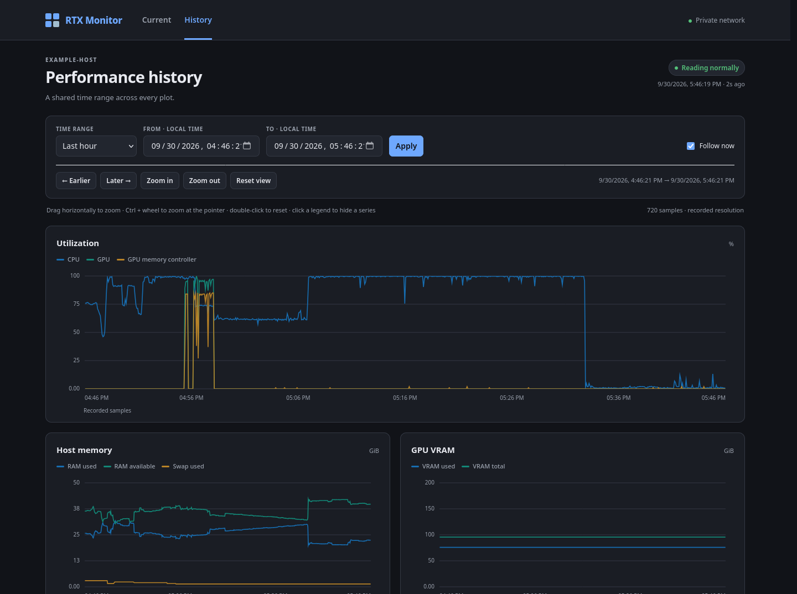

# RTX Monitor

A small, private dashboard for Linux host and optional NVIDIA GPU monitoring.
Python standard library, SQLite, and local HTML/CSS/JavaScript. No Python packages,
containers, or external monitoring services required.

Clone the generic application, then let your coding agent configure it for your
machine with one [setup prompt](DEVICE_AGNOSTIC_IMPLEMENTATION_PROMPT.md).
Machine-specific settings live in ignored `config.json`; the application stays reusable.

## Quick start with a coding agent

1. Clone this repository using its GitHub **Code** URL, then enter the directory:

   ```bash
   git clone <REPOSITORY-URL> rtx-monitor
   cd rtx-monitor
   ```

   A downloaded ZIP works too: extract it and open the extracted project directory.

2. Open Claude Code, Codex, Pi, or another coding agent in that directory and say:

   > Follow DEVICE_AGNOSTIC_IMPLEMENTATION_PROMPT.md to configure, install, and verify RTX Monitor on this machine. Prefer configuration over code changes.

3. The agent checks the host, prepares local configuration, runs tests, installs
   the service, and gives you the private dashboard URL. It asks about network mode
   if Tailscale is unavailable. Installation requires `sudo` access.

The prompt is deliberately short: inspect once, configure what is needed, and use
the existing installer. No generated project scaffolding or agent-specific files.

## What it looks like

Real measurements from one Linux/NVIDIA host; the hostname is anonymized.
Available sensors and readings vary by machine.





## Requirements

- Linux with host metrics in `/proc` and `/sys`.
- Python 3.8+ at `/usr/bin/python3`, with SQLite 3.24+ support.
- systemd and a normal login account for the supplied installer/service.
- Connected Tailscale for the default network mode, or an explicit private LAN IPv4.
- Optional: `nvidia-smi` from an existing NVIDIA driver for GPU telemetry.

A host without an NVIDIA GPU still collects CPU, memory, storage, and network data.
Unsupported readings appear as `—`, not zero.

## Install manually

From the cloned or extracted project directory:

```bash
cp config.example.json config.json
# Edit config.json if this machine needs different settings.
python3 -B -m unittest discover -s tests -v
sudo bash install.sh
```

The installer validates configuration and runs the tests before replacing application
files. It installs into `/opt/rtx-monitor` and runs as the account that invoked `sudo`.
For another existing normal account, use `sudo MONITOR_USER=myuser bash install.sh`.

On first installation, your source `config.json` is used, or the example if none
exists. On upgrades, `/opt/rtx-monitor/config.json` takes precedence and existing
data is preserved. Edit that installed configuration to change a running service.
The installer does not install drivers, packages, or Tailscale, or change firewall
rules, GPU clocks, or power limits.

## Private network access

**Tailscale (default):** keep `"bind": "tailscale"`. Connect the monitored host and
the viewing device to the same Tailnet with permission to communicate. On the host,
`tailscale ip -4` shows its address. Open `http://<TAILSCALE-IP>:8765/` for current
readings or `http://<TAILSCALE-IP>:8765/history` for history.
The listener uses `tailscale0` directly and waits if it is unavailable; sampling
continues. Use the exact IP and port in the URL.

**Closed LAN:** set `"bind": "192.168.1.50"` in `config.json` before installing,
replacing the example with an IPv4 actually assigned to this host. Open
`http://192.168.1.50:8765/` or `http://192.168.1.50:8765/history` from another device
on the private network. Tailscale is not required in this mode.

LAN binds must be in `10.0.0.0/8`, `172.16.0.0/12`, or `192.168.0.0/16`.
Wildcard, public, and hostname binds are rejected. The dashboard has no login;
use it only on a trusted private network. Do not forward its port to the Internet.
`127.0.0.1` is reserved for development/tests and rejected by the installer.

## Configuration and metrics

See [config.example.json](config.example.json) for every supported setting.

| Setting | Default | When to change it |
| --- | --- | --- |
| `bind` | `tailscale` | Use an explicit private IPv4 for LAN access |
| `port` | `8765` | Another service already uses this port |
| `storage_path` | `/` | Monitor another filesystem; use an absolute path |
| `network_interfaces` | `[]` | Override automatic selection, e.g. `["enp5s0"]` |
| `nvidia_smi_path` | `auto` | An NVIDIA executable needs an explicit path |
| `gpu_index` | `0` | Monitor another available NVIDIA GPU |
| `database` | `data/monitor.db` | Keep this for the supplied service |
| `interval_seconds` | `5` | Sampling interval in seconds |
| `retention_days` | `30` | History retention in days |

Host metrics include total/per-core CPU use, CPU frequency and temperature when
available, RAM/swap, load, uptime, filesystem capacity and block I/O, physical
network and Tailscale traffic, and fan sensors. GPU metrics include utilization,
memory-controller activity, VRAM, temperature, power, clocks, fan, and driver details.

History supports range presets, custom ranges, pan, drag-to-zoom, Ctrl+wheel zoom,
and reset. Long ranges retain mean/minimum/maximum values so peaks remain visible.

After editing `/opt/rtx-monitor/config.json`:

```bash
sudo systemctl restart rtx-monitor
systemctl status rtx-monitor --no-pager
journalctl -u rtx-monitor -n 50 --no-pager
```

Use `sudo systemctl stop rtx-monitor` or `sudo systemctl start rtx-monitor` to stop
or start it. Its database is at `/opt/rtx-monitor/data/monitor.db`.

## Test and contribute

Tests need no configuration, NVIDIA GPU, or Tailscale connection. They use temporary
databases and loopback HTTP servers and leave the installed database untouched.

```bash
python3 -B -m unittest discover -s tests -v
bash -n install.sh
```

For a development server, use `python3 -B monitor.py --bind 127.0.0.1` from the
source tree; it creates a local ignored `data/monitor.db`. Stop it with Ctrl+C.

See [CONTRIBUTING.md](CONTRIBUTING.md) for the contribution workflow.
Keep configuration, measurements, logs, secrets, and installation reports out of
commits. The project is released under the [MIT License](LICENSE).
